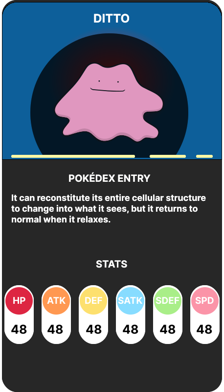

# JSFrontEnd

Este repositorio corresponde a la práctica de la Semana 4 del curso de **LaunchX**.

Para esta práctica se nos pidió implementar lo aprendido en dicha semana, con el objetivo de darle vida a nuestras aplicaciones web. En particular, darle vida a una _Pokédex_. 

El diseño de la interfaz fue inspirado a partir de los siguientes proyectos:

* <a href="https://www.behance.net/gallery/45859535/Pokemons-is-everywhere/modules/274030343" target="_blank">Pokemons is everywhere</a>
* <a href="https://www.behance.net/gallery/113562309/Pokemon-Pokedex-Website-Redesign-Concept/modules/648800201" target="_blank">Pokemon - Pokedex Website Redesign Concept</a>

La interfaz quedó como se muestra en la imagen siguiente.

<figure>
    

        
    

</figure>

Además, se consultó el API provisto por <a href="https://pokeapi.co/" target="_blank">PokéAPI</a>.

Por otro lado, la página desplegada se puede encontrar en el siguiente enlace: <a href="https://pokedex-marcoslm.netlify.app/" target="_blank">Pokédex</a>.
